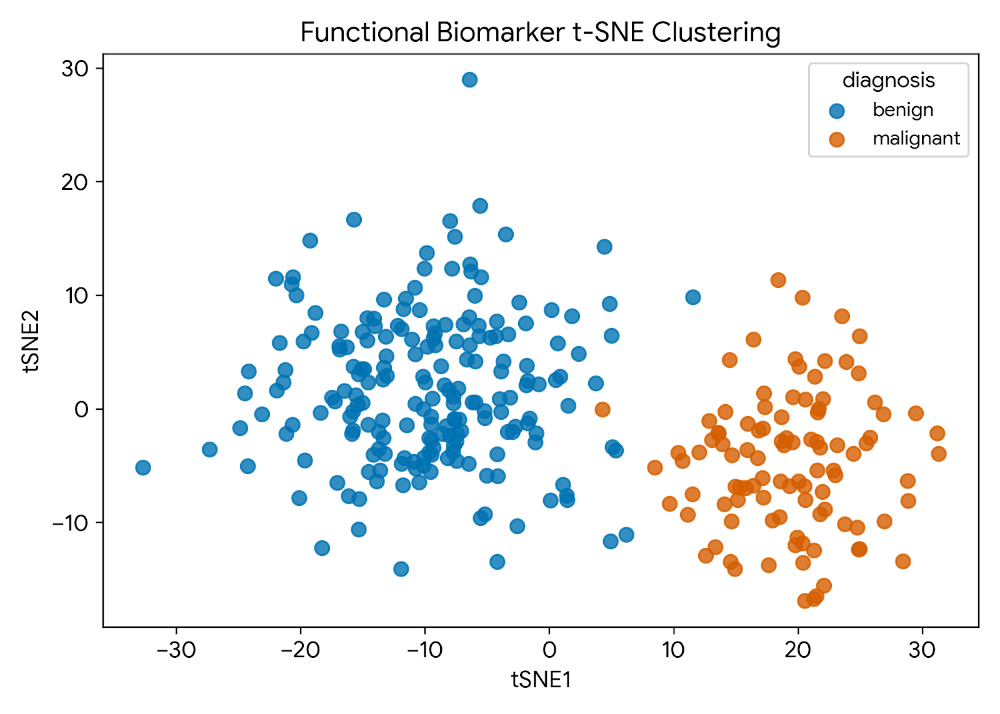
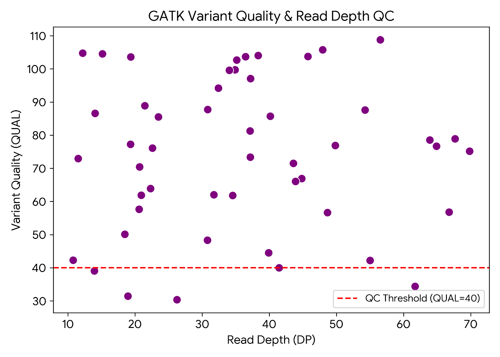

# Bioinformatic-MutiTool
Translational Bioinformatics Multi-Tool Pipeline
Production-grade genomics workflow combining **Galaxy/Snakemake**, **GATK4**, **Julia/Pandas**, **Docker**, and **Nextflow** benchmarked on the Breast Cancer Wisconsin diagnostic dataset.

## 📊 Pipeline Architecture & Tools
1. **Containerization:** Docker & Conda environment specifications (`Dockerfile`, `environment.yml`).
2. **Orchestration:** Snakemake DAG execution managing modular tasks.
3. **Variant Discovery:** GATK `HaplotypeCaller` & hard filtering (`QUAL > 40`, `DP > 15`).
4. **Data Analytics:** High-speed DataFrame parsing & t-SNE functional clustering.

## 🚀 Quick Start & Installation
\`\`\`bash
git clone https://github.com/JStefRenuns/Bioinformatic-MutiTool.git
cd Bioinformatic-MutiTool
conda env create -f environment.yml
conda activate bioinfo-master
snakemake --cores 4
\`\`\`

## 📈 Results & Visualizations

### Data Analysis Pipeline
* **t-SNE Script:** Review the complete data ingestion and scaling code in the [t-SNE Clustering Script](scripts/tsne_clustering.py)

### GATK Variant Quality & Depth QC
* **GATK QC Script:** Review the complete variant quality control code in the [GATK QC Script](scripts/gatk_qc.py)

### Pipeline Results & Execution
* **t-SNE Clustering:**
  
* **GATK QC:**
  

  * **Nextflow Pipeline:** Review the workflow orchestration code in the [Nextflow Example Pipeline](nextflow_example.nf)
 
#  DESeq2 Differential Expression Analysis
The workflow includes an R-based DESeq2 analysis step (scripts/run_deseq2.R) that processes count data from STAR and generates a results CSV alongside a visualization of differentially expressed genes.

*  Analysis Log: Review the execution log for the R analysis step in DESeq2 Execution Log.

Differential Expression Results: The resulting table of identified DEGs can be found in DESeq2 Results CSV.

#  Differential Expression Visualization
This volcano plot visualizes the results of the DESeq2 analysis, highlighting statistically significant up- and down-regulated genes (in orange) based on fold change and adjusted p-value thresholds
